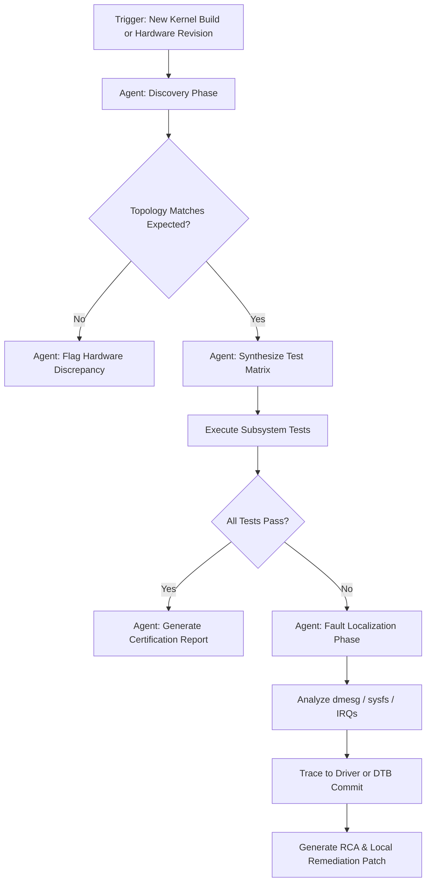

# 🤖 Autonomous BSP Validation Agent Proposal

This document outlines the definition, architecture, and core capabilities for an **Autonomous Board Support Package (BSP) Validation Agent**. This agent bridges the gap between software QA automation and physical hardware testing by combining Large Language Models (LLMs) with hardware-in-the-loop (HIL) execution.

---

## 📖 1. Core Definition

> **The Autonomous BSP Validation Agent** is an AI-driven, goal-oriented system capable of interpreting hardware specifications, autonomously synthesizing execution strategies, and continuously validating the hardware-software boundary of embedded systems. It dynamically analyzes system state (via `dmesg`, `sysfs`, `procfs`), executes peripheral tests (PCIe, I2C, SPI, UART, Ethernet), and proactively localizes kernel or hardware faults down to the specific driver, device tree overlay, or physical connection layer.

---

## 🧠 2. Agentic Capabilities

Unlike a traditional static test script (like standard Pytest), the BSP Validation Agent possesses **dynamic reasoning capabilities**:

### A. Dynamic Topology Discovery
The agent does not blindly run tests; it first explores the hardware. It uses tools like `lspci`, `lsusb`, `i2cdetect`, and `gpiodetect` to build a mental map of the board's live topology and cross-references it against expected profiles (`boards.yaml`).

### B. Autonomous Fault Localization
When a test fails (e.g., an NVMe throughput drop or an I2C NACK), the agent doesn't just throw an assertion error. It autonomously pivots to investigation mode:
- Scans `dmesg` for localized AER or driver binding errors.
- Checks `/proc/interrupts` to see if MSI-X IRQs are wedged.
- Queries Git commit history to find if a recent Device Tree (`.dts`) change or Kernel patch caused the regression.

### C. Human-in-the-Loop (HITL) Interventions
The agent knows its physical limitations. If a test requires a physical loopback cable, a button press, or a multimeter reading, it pauses execution and explicitly requests human intervention through an alert:
> [!IMPORTANT]
> **Agent Request:** "Please connect a jumper wire between GPIO 17 (TX) and GPIO 27 (RX) to allow me to validate the UART loopback. Type 'DONE' when complete."

---

## ⚙️ 3. Workflow & Architecture

---

## 🛠️ 4. Sub-Agent Specialized Personas

To handle the complexity of a BSP, the Agent operates using a multi-agent routing architecture:

1. **The Kernel Investigator:** Specializes in Linux subsystems, `dmesg` deciphering, and kernel oops/panic analysis.
2. **The Peripheral Driver:** Specializes in talking directly to hardware via `i2cget`, `spi-pipe`, and raw memory maps (e.g., `/dev/mem`).
3. **The QAOps Committer:** Responsible for tying hardware failures back to the CI/CD pipeline, identifying the exact Git commit that broke the board, and optionally proposing a code revert.

---

## 🚀 5. Implementation Roadmap

### Phase 1: Context & Tooling (Current State)
We currently have the robust Pytest framework, remote SSH deployment (`conftest.py`), and raw peripheral tests.

### Phase 2: Agent Wrapping (Next Step)
Wrap the existing test outputs in a LangChain/LangGraph architecture. When Pytest returns a non-zero exit code, the Agent parses the JSON/XML output, SSHs back into the Pi, and runs diagnostic commands to find the root cause.

### Phase 3: Standalone Reporting & Remediation
The Agent will operate independently without tying into a specific CI/CD pipeline (e.g., GitHub Actions). Upon identifying a fault, it will generate a comprehensive Root Cause Analysis (RCA) report locally. If a specific driver patch or Device Tree overlay is identified as the culprit, it will generate a local patch/revert file for the engineer to review and apply manually.
